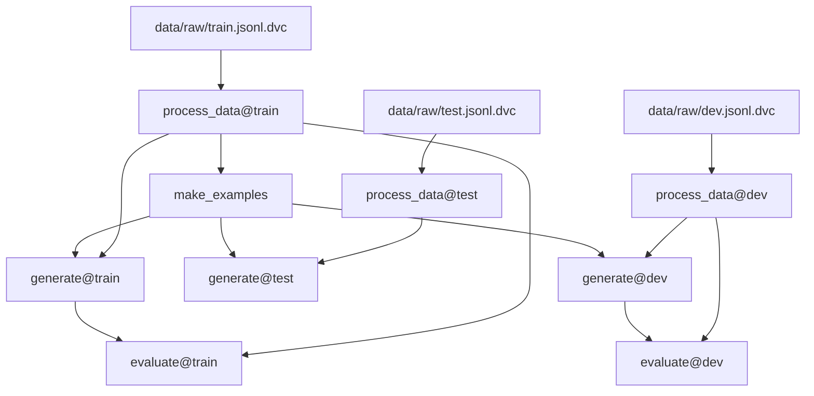

# Elicit Takehome: AI Papers

## Project Outline
My goal with this project is to strike a balance between demonstrating strong NLP fundamentals, proficiency with modern tech and tools, and a meta-level demonstration of how I structure projects and ML experimentation. Therefore, my priorites are as follows:
1. Lay out the end-to-end model-loading -> inference -> evaluation pipeline
1. Complete at least one basic experiment (e.g. simple prompt engineering) and open PR with change report.
1. Document results and ideas for further improvement
1. Test more improvements as feasible in the remaining time
    * Based on my preliminary research, two ideas I'd like to experiment with are task decomposition and auto-optimization using dspy.

## Using This Repo
### Getting Started
The easiest way to get started is to clone the repo and open it in VS Code with the [Dev Container extension](https://marketplace.visualstudio.com/items?itemName=ms-vscode-remote.remote-containers) installed. VS Code should detect the `.devcontainer/devcontainer.json` and prompt you to-reopen the project in the devcontainer. You can also run the "Open in Devcontainer" command manually.

For convenience, you could instead `docker image pull sjawhar/ai_papers` from Docker Hub and `docker run -it -v $(pwd):/home/ai_papers/app bash` to get a terminal where you can run all the relevant commands. Note that the default user in the `ai_papers` image has a UID and GID of 1000, so if the environment where you're running has a different user/group ID you might run into permission issues.

Finally, you can instead use `poetry install` to create a virtual environment for this project with the necessary Python packages. Use `poetry shell` to open a shell session inside the venv.

### The Pipeline



* `process_data` transforms the datasets in `data/raw` to `data/processed` by separating the title and abstract, stripping the metadata, and converting the label to boolean. This allows each sample to be fed directly into the prompt in the `generate` stage with no additional processing.
* `make_examples` encapsulates the logic for few-shot example selection. Though this is currently static, it could be used to compare performance across a variety of example quality thresholds.
* `generate` consumes a dataset and a prompt template and saves the model output and predictions to `preds/${DATASET}.jsonl`
    * These JSON objects contain two keys: a boolean `label`, and the `response` generated text (not including the input).
    * The prompts are currently using Jinja2 for templating, but could be easily changed to e.g. LangChain format for more complex call chains.
* Finally, `evaluate` consumes `data/processed` and `preds` to compare true and predicted labels and evaluate performance.

### Running the Pipeline
This repo uses [DVC](https://dvc.org/doc) to version data, pipelines, and experiments.
  * Some of the files listed above will appear to be missing from the repo because they are tracked and managed by DVC rather than being checked into git. To pull all these files from the remote, run `dvc pull`.
  * This might take a while the first time as it will also pull the GPT2 model files from HuggingFace Hub. If you don't intend to run the pipeline and only want to see the outputs, you can run `dvc pull dvc.yaml` or even `dvc pull $STAGE_NAME` (where `$STAGE_NAME` is a stage in `dvc.yaml` like `generate@test`) to only pull a subset of the outputs.
  * To run the pipeline end-to-end, use `dvc repro`. If you've run `dvc pull` and made no other changes, the output from `dvc repro` will indicate that there are no changes to the pipeline and skip execution.
  * To force-rerun a stage, use e.g. `dvc repro --single-item --force generate@dev`. Running `git diff` afterwards should show no changes to `dvc.lock`.
  * You can then try changing a parameter in `params.yaml` and running `dvc repro` to re-run the pipeline with that new parameter. Afterward, try running `dvc metrics diff` to see the change in the evaluation metrics.
    * `params.yaml` contains configurable options such as the model and prompt to use, the number of examples to include in each prompt, etc. These are tracked by DVC and can be used to easily track and compare experiments.
  * To see the metrics as computed in the current state of the repo, use `dvc metrics show`

You don't actually _need_ to use DVC to run any of the code, though. You could instead run `python ai_papers/${STAGE_NAME}.py [args ...]` directly. Use `--help` to get a list of arguments and options, or look in `dvc.yaml` for the "canonical" usage for each stage.

### Directory Structure
```
.
├── Dockerfile
├── INSTRUCTIONS.md
├── README.md
├── ai_papers/                  # Directory of pipeline stage entrypoints and code
├── data/
│   ├── processed/              # Cleaned-up train/dev samples
│   └── raw/                    # Raw data from shared GDrive folder
│       ├── dev.jsonl.dvc
│       ├── test.jsonl.dvc
│       └── train.jsonl.dvc
├── dvc.lock                    # Tracks the latest parameters and hashes of all inputs/outputs in the pipeline
├── dvc.yaml                    # Model prompting and evaluation pipeline
├── metrics/                    # Model evaluation metrics
│   ├── dev.yaml
│   └── train.yaml
├── models/
│   └── gpt2/                   # GPT2 model files, version-tracked and imported from HuggingFace Hub
├── params.yaml                 # Parameters used by DVC pipeline and code files
├── poetry.lock
├── preds/                      # Model predictions
│   ├── dev.jsonl
│   ├── test.jsonl
│   └── train.jsonl
├── prompts/                    # Directory for tracking and versioning prompts
│   └── baseline.txt
└── pyproject.toml
```

## References
- https://python.langchain.com/docs/integrations/llms/huggingface_pipelines
- Reppert, J., Rachbach, B., George, C., Stebbing, L., Byun, J., Appleton, M., & Stuhlmüller, A. (2023). Iterated decomposition: Improving science q&a by supervising reasoning processes. _arXiv preprint arXiv:2301.01751_.

## Worklog
02 Mar
* 1310-1429 - Repo setup
* 1816-2013 - Task 1 - Test stage

03 Mar
* 1135-1536 - Task 1 - Evaluation and few-shot prompt
* 1824-2049 - Task 2 - Experiments